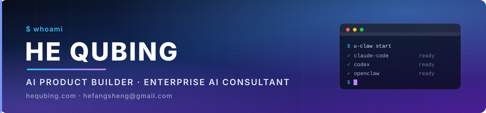

  

  
  
  

  
  

## 👋 关于我

**贺去病（Dosen）** — 独立 AI 产品开发者，也帮中小企业把 AI 真正用到业务里。

我做的东西有一个共同点：**装上就能用**。不配环境、不改代码、不等排期 —— U 盘插上就有 Claude Code，
双击就跑的 Windows 维护工具，放一个文件进去就多一个 AI 能力。

- 🚀 **在做**：AI 工具链 · AI 时代的软件架构（一个动作只实现一次，人能点、AI 也能调）
- 🧭 **在想**：AI 的输出天生不确定，所以交付物必须可校验 —— 每个结论都得回答得出「凭什么」
- 🛠 **常用**：Node / TypeScript · Rust · Go · PowerShell · Shell · Python
- 💼 **可以找我聊**：企业 AI 落地、内部 AI 工具定制、开源项目合作
- 📫 **联系**：[hefangsheng@gmail.com](mailto:hefangsheng@gmail.com) · [hequbing.com](https://hequbing.com) · Telegram [@dsds8848](https://t.me/dsds8848)

> **EN** — Independent AI product builder & enterprise AI consultant. I ship AI tooling that works out of
> the box: offline USB installers, zero-dependency CLIs, and an evidence-first object layer for agents.
> Open to consulting and collaboration — **hefangsheng@gmail.com**.

---

## 🚀 代表作

### [U-Claw 虾盘](https://github.com/dongsheng123132/u-claw) &nbsp; 

**离线 U 盘装 AI 助手** —— 插上就有 Claude Code / Codex / OpenClaw，不用联网、不用配环境、不用会命令行。
给「想用 AI 但装不起来」的人准备的：一支 U 盘，一次双击。

### 其他在做的

| 项目 | 一句话 |
| :-- | :-- |
| [**Open365**](https://github.com/dongsheng123132/Open365) | 不联网上传的 Windows 维护工具：清理 / 开机加速 / 网络修复 / 安全护盾 / 守夜模式。纯 PowerShell 引擎。 |
| [**opencodex**](https://github.com/dongsheng123132/opencodex) | ~4.7MB 绿色多终端 AI 编程工作台：以文件夹为单位，主区直接是终端，分屏跑 Claude Code / Codex。 |
| [**U-Hermes 虾米**](https://github.com/dongsheng123132/u-hermes) | Hermes Agent 中文便携版：Linux Live 免安装启动盘 + Windows 版，插上就用。 |
| [**2Origin 本象协议**](https://github.com/dongsheng123132/2origin) | 面向 AI 的持久对象层：AI 只提交语义事务，确定性编译器校验后才落地，每个字段都能回答「凭什么」。 |
| [**PodApp 程序舱**](https://github.com/dongsheng123132/podapp) | 把 AI 不确定的输出交给确定的动作去加工。装一个 `.pod` 就多一个能力，同时自动成为 MCP 工具。 |
| [**ActionParity 影核**](https://github.com/dongsheng123132/action-parity) | 开放标准：一个业务动作只实现一次，GUI / CLI / MCP / API 共用同一条代码路。 |
| [**task-passport**](https://github.com/dongsheng123132/task-passport) | 跨 harness 的任务交接协议：换个 AI 接着干，上下文和进度不丢。 |

还有 100+ 个公开仓库 —— 证据链插件、文档一致性检查、CAD 审查、科研工具等，欢迎 <a href="https://github.com/dongsheng123132?tab=repositories&sort=stargazers">翻一翻</a>。

---

## 📫 找我

| 渠道 | 地址 |
| :-- | :-- |
| 🌐 **个人网站** | [hequbing.com](https://hequbing.com) —— AI 落地案例与咨询 |
| ✉️ **邮箱** | [hefangsheng@gmail.com](mailto:hefangsheng@gmail.com) |
| 💬 **Telegram** | [@dsds8848](https://t.me/dsds8848) |
| 💚 **微信** | 官网右下角浮窗扫码 |

企业 AI 落地、内部 AI 工具定制、开源项目合作 —— 都欢迎来聊。

「把 AI 装进能用的产品里，而不是停在 Demo。」

